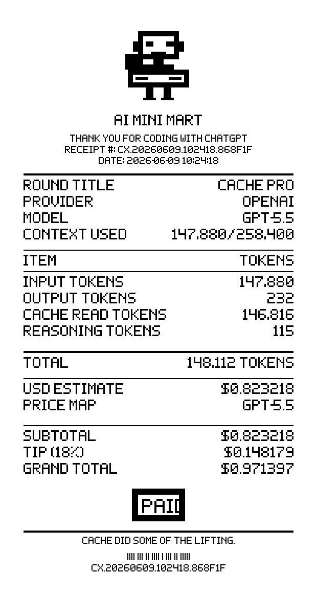
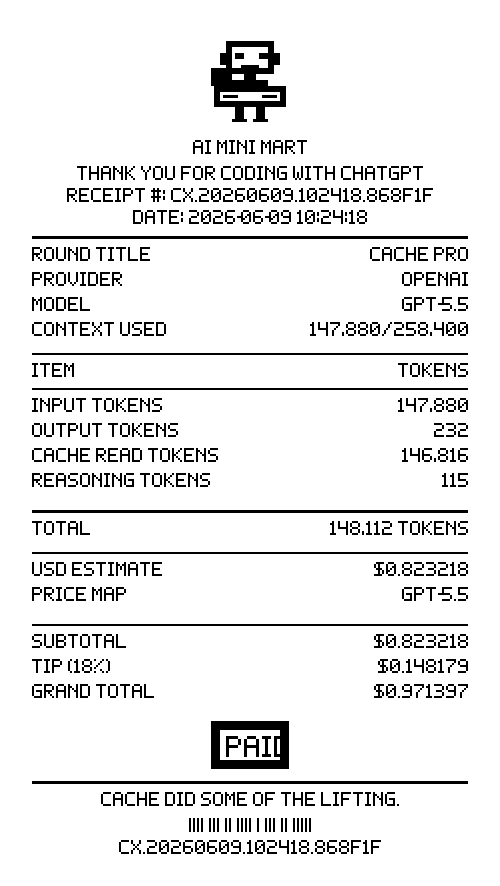
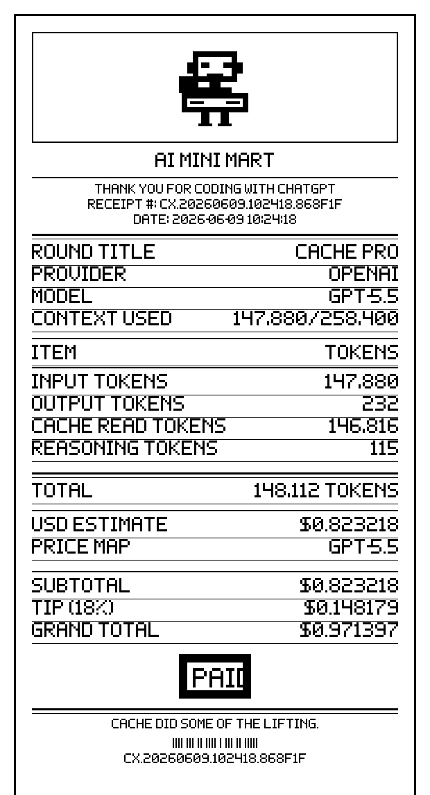

# AI Mini Mart Receipt

AI Mini Mart Receipt is a tiny printable token receipt generator. It turns an AI
usage snapshot into a thermal-paper style text receipt and a printable 80mm HTML
page.

The first theme is `AI MINI MART`: a monochrome cashier counter, a round title
row, tip presets, a custom tip input, and a `PAID` pixel stamp.

It does not call provider APIs or read billing data for you. You pass usage
numbers through CLI flags, and it renders a local receipt.

## Screenshots

| Classic | Compact | Ledger |
| --- | --- | --- |
|  |  |  |

## Quick Start

```bash
git clone https://github.com/Longado/ai-mini-mart-receipt.git
cd ai-mini-mart-receipt
/usr/bin/python3 -m pip install .
ai-mini-mart-receipt \
  --provider OPENAI \
  --model gpt-5.5 \
  --input-tokens 147880 \
  --cached-input-tokens 146816 \
  --output-tokens 232 \
  --reasoning-output-tokens 115 \
  --context-window 258400 \
  --estimate-usd 0.823218 \
  --language zh-CN \
  --style classic \
  --write /tmp/ai-mini-mart-receipt.txt \
  --write-html /tmp/ai-mini-mart-receipt.html
```

Open `/tmp/ai-mini-mart-receipt.html` in a browser and print it on an 80mm
receipt layout.

## Install

AI Mini Mart Receipt is a small Python package. For direct CLI use, install it
from the repository root:

```bash
/usr/bin/python3 -m pip install .
```

You can also run it without installing by prefixing commands with
`PYTHONPATH=src` and using `python -m ai_mini_mart_receipt.cli`.

## Usage

Generate both a text receipt and a printable HTML receipt:

```bash
ai-mini-mart-receipt \
  --provider OPENAI \
  --model gpt-5.5 \
  --input-tokens 147880 \
  --cached-input-tokens 146816 \
  --output-tokens 232 \
  --reasoning-output-tokens 115 \
  --context-window 258400 \
  --estimate-usd 0.823218 \
  --language zh-CN \
  --style ledger \
  --write /tmp/ai-mini-mart-receipt.txt \
  --write-html /tmp/ai-mini-mart-receipt.html
```

For terminal output only:

```bash
ai-mini-mart-receipt \
  --input-tokens 4200 \
  --output-tokens 340 \
  --estimate-usd 0.031 \
  --language en
```

## Options

- `--style classic|compact|ledger`: choose the printable HTML receipt style.
- `--language en|zh-CN`: choose English or Chinese receipt labels.
- `--output text|html`: print text or HTML to stdout.
- `--write PATH`: write the selected output format to a file.
- `--write-html PATH`: always write a printable HTML receipt.
- `--location TEXT`: add an optional location line.
- `--total-tokens N`: override the computed total when your source already has one.

## What It Includes

- `15% / 18% / 20%` tip presets.
- A custom tip percentage input in the HTML print view.
- HTML receipt styles: `classic`, `compact`, and `ledger`.
- Round titles:
  - `缓存达人` when cache read is at least 80% of input tokens.
  - `预算警报` when total tokens are at least 100,000 or estimate is at least $0.50.
  - `推理加班` when reasoning tokens are unusually high.
  - `预算正常` otherwise.
- Deterministic 1-bit-style pixel assets generated by `scripts/generate_assets.py`.

## Development

For editable development installs, upgrade pip first so modern `pyproject.toml`
editable installs are supported:

```bash
/usr/bin/python3 -m pip install --upgrade pip
/usr/bin/python3 -m pip install -e .
```

Regenerate package assets and README screenshots:

```bash
/usr/bin/python3 scripts/generate_assets.py
/usr/bin/python3 scripts/generate_screenshots.py
```

Run the test suite:

```bash
PYTHONPATH=src /usr/bin/python3 -m unittest discover -s tests -v
PYTHONPATH=src /usr/bin/python3 -m py_compile src/ai_mini_mart_receipt/*.py scripts/*.py
```

## Repo Shape

```text
src/ai_mini_mart_receipt/         Receipt renderer and CLI package
src/ai_mini_mart_receipt/assets/  Generated runtime PNG assets
scripts/                          Deterministic asset and screenshot generators
docs/screenshots/                 README preview images
tests/                            Unit tests and CLI smoke tests
```

## License

MIT License. See `LICENSE`.
